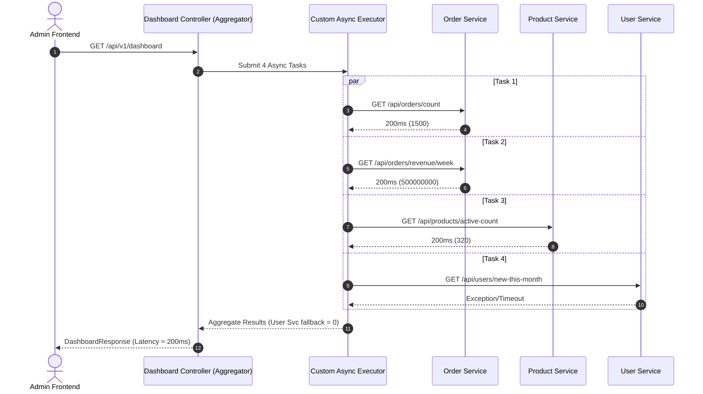

# VietMart Dashboard API Aggregator Pattern

## 1. Ph&acirc;n T&iacute;ch Hiệu N&00e0ng: Tuần Tự vs Song Song

### Lờ2 Gọi Đồng Bộ Tuần Tự (Sequential Calls)
Trong c&aacute;ch tiếp cận cũ:
- T_total = T_totalOrders + T_weekRevenue + T_activeProds + T_newUsers
- T_total = 200ms + 200ms + 200ms + 200ms = 800ms
- Thread đảm nhận xử l&yacute; HTTP request bị kh&oacute;a (block) lần lượt qua từng network call I/O. Tổng độ trề bằng tổng thối gian thực thi của tất cả c&aacute;c service th&00e0nh phần.

### Lờ2 Gọi Song Song (Parallel Aggregation)
Vớ2 API Aggregator Pattern d&00f9ng `CompletableFuture` v&00e0 Thread Pool ri&00ea;ng:
- T_total = max(T_totalOrders, T_weekRevenue, T_activeProds, T_newUsers) + T_overhead ≈ 200ms
- Cả 4 request I/O được k&ed0;ch hoạt c&00f9ng một l&00fa;c tới c&00e1;c downstream services. Thread ch&00ed;nh chỉ cần chờ tác vụ chậm nhất ho&00e0;n th&00e0;nh hoặc chạm mức timeout tổng (3s).

---

## 2. Sơ Đồ Kiến Tr&00fa;c API Aggregator Pattern

---

## 3. Ph&acirc;n T&iacute;ch Trade-off (Đ&00e1;nh Gi&00e1; Chi Tiết)

### 3.1. Ưu Điểm
1. **Tối ưu Latency:** Giảm thời gian phản hồi từ 800ms xuống ~200ms (giảm tới 75% độ trề tích lũy).
2. **Khả Năng Kh&00e1;ng Lỗi (Fault Tolerance / Resilience):** Nhờ `exceptionally()`, nếu một service con gặp sự cố (500, Timeout), c&00e1;c widget c&00f2;n lại vẫn hiển thị bình thường vớ2 gi&00e1; trị mặc định (0 hoặc -1) thay v&00ec; l&00e0;m hỏng toàn bộ dashboard.
3. **Isolate Thread Pool:** Kh&00f4;ng l&00e0;m nghẵn `ForkJoinPool.commonPool()` bằng c&00e1;ch định nghĩa Executor ri&00ea;ng cho tác vụ I/O Dashboard.

### 3.2. Nhược Điểm & Th&00e1;ch Thức
1. **Ti&00ea;u Tốn Tài Nguy&00ea;n (Resource Consumption):**
   - Tăng số lượng Threads hoạt động c&00f9ng l&00fa;c (Context switching overhead).
   - Tạo tải đột biến (Burst traffic) l&00ea;n các microservices phía sau trong c&00f9ng một thời điểm.
2. **Độ Phức Tạp Mã Nguồn (Code Complexity):** Phả2 quản l&00fd; Thread Pool, xử l&00fd; Timeout tổng, v&00e0; Fallback logic cho từng task.
3. **Th&00e1;ch Thức Debugging & Distributed Tracing:**
   - Thread context (`SecurityContextHolder`, `MDC` traceId) kh&00f4;ng tự động truyền sang các Async Threads nếu kh&00f4;ng c&00e1;ch ly hoặc cấu hình `TaskDecorator`.
   - Stacktrace từ async thread kh&00f4;ng trực tiếp liên kết vớ2 HTTP request main thread.

---

## 4. Bảng So S&00e1;nh

| Ti&00ea;u ch&00ed; | Tuần tự (Cũ) | Async Aggregator (Mớ2) |
| :--- | :--- | :--- |
| **Thời gian phản hồi** | ~800ms | ~200ms - 250ms |
| **T&00e1;c độ khi 1 service hạ** | Lỗ2 toàn bộ (HTTP 500) | Trả về Dashboard vớ2 fallback = 0 |
| **Timeout tổng** | Kh&00f4;ng c&00f3; (Chờ từng service) | Giớ2 hạn tối đa 3s |
| **Thread Execution** | Single Tomcat Request Thread | Dedicated ThreadPoolTaskExecutor |
