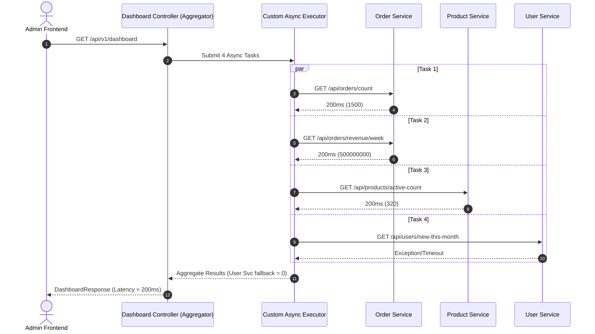

# VietMart Dashboard API Aggregator Pattern

## 1. Phân Tích Hiệu Năng: Tuần Tự vs Song Song

### Lời Gọi Đồng Bộ Tuần Tự (Sequential Calls)
Trong cách tiếp cận cũ:
- T_total = T_totalOrders + T_weekRevenue + T_activeProds + T_newUsers
- T_total = 200ms + 200ms + 200ms + 200ms = 800ms
- Thread đảm nhận xử lý HTTP request bị khóa (block) lần lượt qua từng network call I/O. Tổng độ trễ bằng tổng thời gian thực thi của tất cả các service thành phần.

### Lời Gọi Song Song (Parallel Aggregation)
Với API Aggregator Pattern dùng `CompletableFuture` và Thread Pool riêng:
- T_total = max(T_totalOrders, T_weekRevenue, T_activeProds, T_newUsers) + T_overhead ≈ 200ms
- Cả 4 request I/O được kích hoạt cùng một lúc tới các downstream services. Thread chính chỉ cần chờ tác vụ chậm nhất hoàn thành hoặc chạm mức timeout tổng (3s).

---

## 2. Sơ Đồ Kiến Trúc API Aggregator Pattern

---

## 3. Phân Tích Trade-off (Đánh Giá Chi Tiết)

### 3.1. Ưu Điểm
1. **Tối ưu Latency:** Giảm thời gian phản hồi từ 800ms xuống ~200ms (giảm tới 75% độ trễ tích lũy).
2. **Khả Năng Kháng Lỗi (Fault Tolerance / Resilience):** Nhờ `exceptionally()`, nếu một service con gặp sự cố (500, Timeout), các widget còn lại vẫn hiển thị bình thường với giá trị mặc định (0 hoặc -1) thay vì làm hỏng toàn bộ dashboard.
3. **Isolate Thread Pool:** Không làm nghẽn `ForkJoinPool.commonPool()` bằng cách định nghĩa Executor riêng cho tác vụ I/O Dashboard.

### 3.2. Nhược Điểm & Thách Thức
1. **Tiêu Tốn Tài Nguyên (Resource Consumption):**
   - Tăng số lượng Threads hoạt động cùng lúc (Context switching overhead).
   - Tạo tải đột biến (Burst traffic) lên các microservices phía sau trong cùng một thời điểm.
2. **Độ Phức Tạp Mã Nguồn (Code Complexity):** Phải quản lý Thread Pool, xử lý Timeout tổng, và Fallback logic cho từng task.
3. **Thách Thức Debugging & Distributed Tracing:**
   - Thread context (`SecurityContextHolder`, `MDC` traceId) không tự động truyền sang các Async Threads nếu không cách ly hoặc cấu hình `TaskDecorator`.
   - Stacktrace từ async thread không trực tiếp liên kết với HTTP request main thread.

---

## 4. Bảng So Sánh

| Tiêu chí | Tuần tự (Cũ) | Async Aggregator (Mới) |
| :--- | :--- | :--- |
| **Thời gian phản hồi** | ~800ms | ~200ms - 250ms |
| **Tác động khi 1 service hạ** | Lỗi toàn bộ (HTTP 500) | Trả về Dashboard với fallback = 0 |
| **Timeout tổng** | Không có (Chờ từng service) | Giới hạn tối đa 3s |
| **Thread Execution** | Single Tomcat Request Thread | Dedicated ThreadPoolTaskExecutor |
